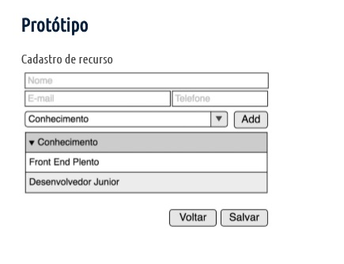

# testephp
Se quiser testar o seu conhecimento, basta seguir os passos abaixo:

1. Clone o projeto para o seu ambiente: https://github.com/ptcmariano/testephp

2. Configurar vhosts para um utilizar subdominio: testephp.localhost/

3. Criar o banco de dados testephp. (utilize usuário root e senha em branco)

4. Crie uma tabela com nome `TProjetos` com os campos `prj_cod` tipo inteito auto incremental, outro campo `prj_nome` como texto limitado a 250 caracteres, outro campo  `prj_descricao`  como texto limitado a 250 caracteres e outro campo  `prj_deleted` como inteiro. Adicione como chave primaria de  `prj_cod`

5. Desenvolver conforme proposto:

5.1 Criar formulário de recurso (e o CRUD -> Create, Read, Update, Delete) conforme imagem do protótipo:

5.2 Conhecimento do Recurso deve vir da base de dados, criar também um CRUD

6. Criar um projeto no seu usuário do bitbucket, enviar a url com os commits feitos

OBS: Faça commits frequentes para as pequenas alterações
